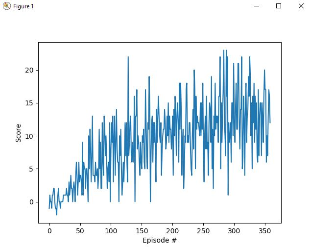
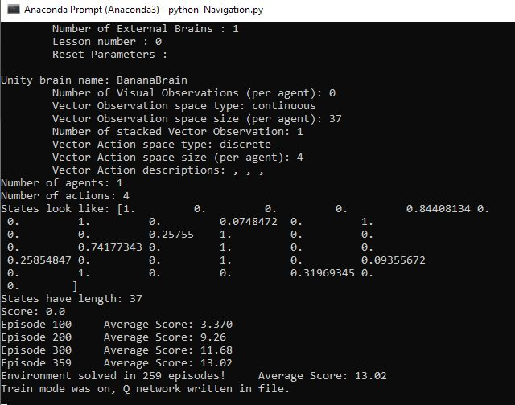

<h1>Report:</h1>

<h2>Learning algorithm</h2>

The software is implementing Deep Reinforcement Learning. The agent makes use of two artificial neural networks to build and represent action-values as weights in the primary Q network and the target Q network as well.

1. The solution initializes an empty replay memory as first,
2. then initializes action value primary and target networks both,
3. finally, episode-by-episode, it takes input frames stacked

<h2>Model architecture of the deep Q neural network applied</h2>

<h2>Hyperparameters chosen</h2>
Similarly to the example task (lunar lander), I applied the following hyperparameters:
BUFFER_SIZE = int(1e5)  # replay buffer size
BATCH_SIZE = 64         # minibatch size
GAMMA = 0.99            # discount factor
TAU = 1e-3              # for soft update of target parameters
LR = 5e-4               # learning rate 
UPDATE_EVERY = 4        # how often to update the network

<h2>Plot of rewards per episode</h2> 

The agent is able to receive an average reward (over 100 episodes) of at least +13. 

Number of episodes needed to solve the environment.

<h2>Ideas for future work</h2>
I would most probably go for Prioritized Experience Replay to further improve the performance of the algorithm. By that approach, the agent could learn more of certain scenarios that are proven as more important, hence visiting those more frequently.
